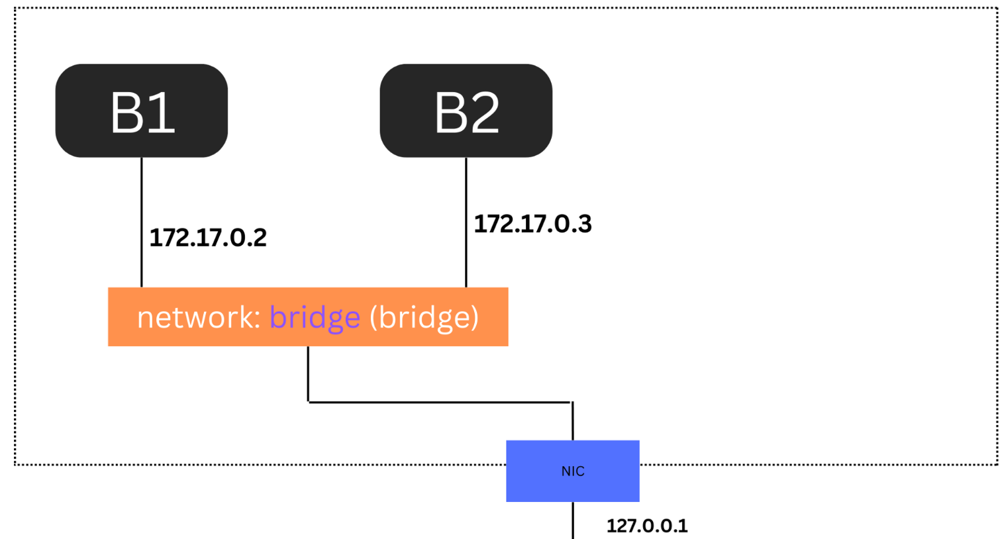

# DOCKER NETWORK BASIC 

# Docker network

làm sao để giao tiếp giữa host , hoặc giữa các container khác nhau ?

Cơ bản 

- Bridge
- Host
- None

```jsx
// lệnh kiểm tra các mạng 
docker network ls 
```

 

## Bridge

Đây là config mặc định khi mình tạo 1 container 

Chính là cầu nối , các container có cùng config networking là bridge trong cùng 1 host có thể liên lạc với nhau 

```jsx
// câu lệnh kiểm tra xem bridge network gồm những container nào 
docker network inspect bridge
```

  
ở đây tức là không có container nào 

```jsx
// tạo 1 container mới
```

  

Bây giờ trong docker đã có 2 container sử dụng chung networking là bridge 

Tiến hành ping kiểm tra hai máy xem có thông mạng hay không  ? 

1. Tiến hành ping ra host 

  

1. Đứng từ container B5 ping sang container B6 

  

1. Tiến hành ping ra internet 




## Host driver

Cấu hình này sử dụng chung các tài nguyên với máy chủ host luôn ( ko bị cô lập nữa , ko cần bind port) 

Network configuration bên trong container đồng nhất với host 

Nó cùng chia sẻ namespace network với host 

  

Namespace Network  :  Mỗi container hoặc máy chủ Linux có một namespace network riêng , cho phép cách ly các thành phần mạng như interface , route, socket giữa các container và máy chủ 

```jsx
// vào môi trường dòng lệng docker 
docker exec -it container sh|bash

```

## None

Là cơ chết container không có thiết lập mạng 

## Tự định nghĩa 1 loại driver

```jsx
//cú pháp 
docker network create --driver bridge nameNewNetwork 

//chạy 1 container chỉ định với network 
docker run --network=nameNewNetwork -itd --name=container3 busybox

// thêm 1 network vào 1 container có sẵn 
docker network connect mynetwork B6
// bỏ 
docker network disconnect mynetwork B6
// xóa network 
docker network rm name 
// xóa tất cả 
docker network prune
```

  

  

> Trường hợp cái container sử dụng bằng network tự defind thì có thể call nhau bằng tên container
>