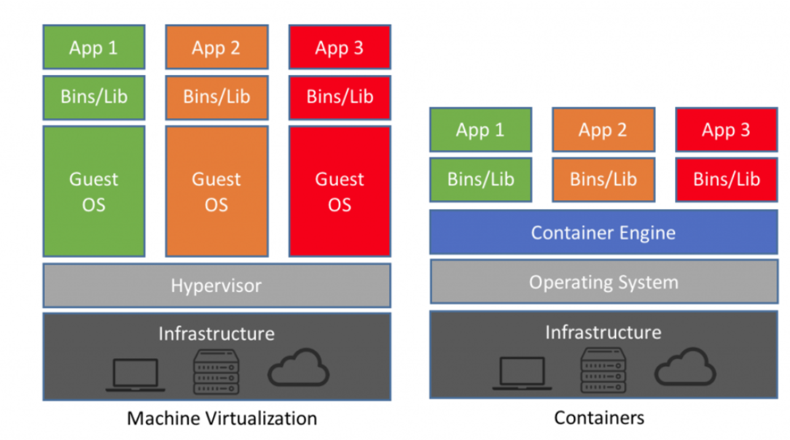
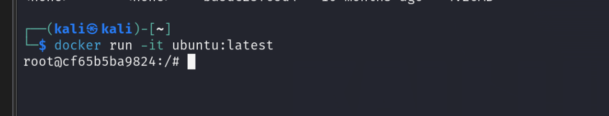
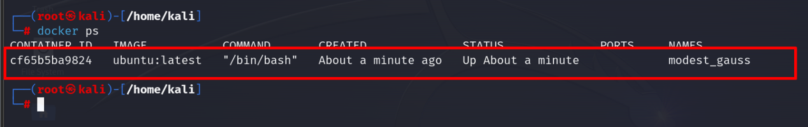

# DOCKER SECURITY BASIC 

# Docker security

## Cơ chế hoạt động của docker

  
Ban đầu nói về mô hình và sự khác nhau giữa VM và docker container 

Infrastructure :  Nó như máy mình , máy vật lý 

Bên VM thì phải cần tạo OS cho từng máy ảo , các app lấy tài nguyên từ các OS đó 

Bên docker , Lấy tài nguyên trực tiếp từ host , ko cần tạo OS , không có Guest OS 

Container Engine có thể thao tác trực tiếp với kernel của host ( Vấn đề bảo mật ??  , nếu config ko chuẩn )

 

## Không có OS riêng thì làm sao để cô lập các container để nó không bị conflict ?

## Confirm các container thực chất chỉ là các process chạy trên host

1. Tiến hành run 1 container và vào chế độ cmd 

  

1. Vào host , kiểm tra các container đang chạy 

  

1. Vì 1 container chỉ là 1 tiến trình nên sẽ có pid , kiểm tra pid của container 


1. /proc : Chứa các thông tin về tài nguyên tiến trình , tài nguyên hệ thống , các thiết bị được kết nối với nhau 

Điều quan tâm là nó chứa thông tin về tiến trình :


Có 1 folder tương ứng với PID  của container 

Vào root tạo thử 1 file flag.txt 


Sang bên container kiểm tra 


Điều này có ích gì trong security ? 

Nếu ai có quyền truy cập vào host mà ( chỉ với xem được process ) đều xem được các dữ liệu trong container mà ko phải thao tác trực tiếp với docker 

## Cô lập các container

Không có OS riêng , chia sẻ cùng kernel ,làm sao để các container này không chọc vào lẫn nhau ?


### Namespaces

Giống như cung cấp cho các process đặt trong nó một không gian riêng ,  cung cấp cái nhìn về 1 hoặc nhiều tài nguyên hệ thống một cách riêng biệt 

VD :  Trong 1 nhà 4 tầng ,mỗi tầng lớp 1 wifi , ( mỗi wifi thì có 1 LAN , trong lan có các thiết bị giống như process ,chỉ trong cùng LAN mới nhìn thấy nhau , 1 ông bắt wifi tầng1 , có thể trùng địa chỉ ip ông tầng 2 ) nhưng ko thể nhìn thấy nhau 

Trong linux thì support  8 namespace : 

- Mount
- PID
- Network
- Cgroup
- IPC
- Time
- UTS
- USER

Nếu cấu hình sai Namespace thì có phải mình sẽ chọc vào được host  ?? 

Kiểm tra container có những namespace nào 

```java
lsns -p  PID
```


**mount namespace**  : cung cấp cho container cái nhìn cô lập về hệ thống file , 

ở trên khi truy cập vào container , chúng ta có thể thấy root nhưng cái root đó không phải ở host 

/proc/[pid]/mountinfo chứa đường dẫn mount point 


như trên thì root của container được mount với đường dẫn /var/lib/docker 

• Mount namespace cho phép ta mount và unmount filesystem mà không ảnh hưởng gì tới host filesystem.

- **PID namespace**  :

cung cấp cái nhìn độc lập với các process khác trên host hoặc container , 

1 process trong container có thể trùng PID với 1 process khác mà không bị conflict 

- **Network namespace**  :

Cô lập mạng 

Mỗi network namespace có một bản sao của giao diện mạng và bảng định tuyến, cho phép cô lập và quản lý mạng độc lập cho các quy trình hoặc ứng dụng.
• Networking namespace cho phép ta chạy chương trình trên bất kì port nào mà không bị xung độ với các process khác chạy trên server.

- **Cgroup namespace :**

Dùng để cô lập và control các tài nguyên hệ thống  dành cho processs

Cgroups sẽ định ra giới hạn của CPU và Memory mà một process có thể dùng

- User namespace

Ta có thể thấy trong container ta có quyền root nhưng nó khác quyền root của host 

## Capabilities

Liên quan đến vấn đề phân quyền , trong Linux chỉ có user bình thường và user root ( UID 1 và UID 0)

là các đơn vị đặc quyền có thể được enable hoặc disable.

  


Vậy những task cần root mới làm được thì chỉ có thể gán quyền root  ? 

Chia nhỏ các quyền thành các đơn vị nhỏ hơn , giảm thiếu tối đa cấp thừa quyền 

Chia nhỏ các quyền và gán nó cho các process 

Kiểm tra các quyền được gán cho container trên “

```java
pscap -p PID 
```


Các quyền mặc định của 1 container  : 

chown, dac_override, fowner, fsetid, kill, setgid, setuid, setpcap, net_bind_service, net_raw, sys_chroot, mknod, audit_write, setfcap

Vấn đề là một số quyền cụ thể có thể call system , 1 container có quyền call system , chọc vào kernel ? 


Một số quyền quan trọng  : 

**CAP_SYS_ADMIN :  cho phép quản lý tài nguyên hệ thống (host )** 

**CAP_SYS_RAWIO :  cho phép quyền truy cập vào các hệ thống I/0** 

cú pháp add capabilities  vào container

```java
 // thêm 
 docker run --cap-add=<CAP> -it <Image_Name>
 //xóa
 docker run --cap-drop=<CAP> -it <Image_Name>
```

// sẽ tìm hiểu thêm 

## DOCKER CONTAINER ESCAPE

1. Mount the host filesystem 

Capability yêu cầu  : SYS_ADMIN

//  demo ko được nên em chưa trình bày