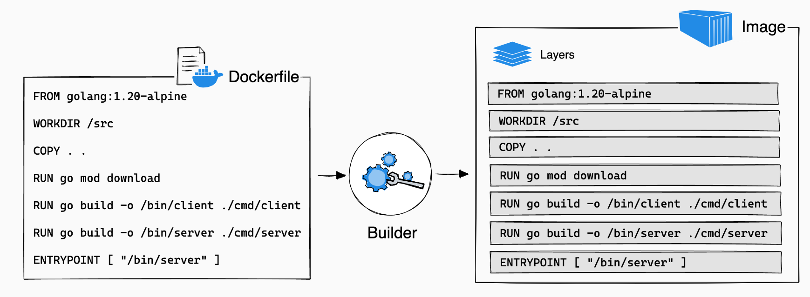

# DOCKER 

## Định nghĩa 
Là một nền tảng mở cho phép phát triển , vận chuyện và chạy các ứng dụng . Cho phép bạn tách biệt ứng dụng khỏi kiến trúc   
Nó cung cấp khả năng đóng gói và chạy các ứng dụng độc lập với nền tảng đang sử dụng 

## Kiến trúc 
Về cơ bản thì docker có 3 thành phần là Docker Client , Docker Host ( chứa Docker Daemon và các docker obj) Và Docker Registry  
Docker daemon : Là nơi nhận request từ client thông qua Docker API và quản lý các docker obj như images, containers , network , volumes  
Doker Clinet :  là nơi user tương tác với docker  
Docker Registry :  Giống như github lưu các images thàng các repo 

## Docker Obj 

### Images 
Image là 1 đơn vị đóng gói chứa mọi thứ cần thiết để chạy ứng dụng  . Nó bao gồm src code , application dependecies , kiến trúc hệ điều hành 

Image là 1 loạt các layer read-only được kết nối với nhau  


Để tạo ra images thì có hai cách  :  
- Tạo thông qua docker file  
- Pull về từ docker registry 

### Container 
Là thể hiện có thể chạy được của images , có thể create , start, stop, movde or delete 
Về cơ bản thì container nó sẽ như máy thu nhỏ của mình , ( window hay ubuntu,macos) cho phép mình chạy ứng dụng trên đó 


### Flow 
từ docker file  =>  Docker Images  =>  Docker Container 

### DOCKERFILE 
```js
FROM node:20.11.1   base images:version ( đi mua máy , cài win or ubuntu )

WORKDIR /app           thư mục làm việc trong container 

COPY package.json /app/  copy sang container 
COPY . .                  . . : copy rest sang container 

RUN npm install           

RUN npx prisma generate


EXPOSE 3000              : port container listen 

CMD [ "npm", "run", "dev" ]


Điểm khác nhau giữa RUN và CMD 

RUN sẽ thực thi trong quá trình build ( tạo 1 layer vào top của image hiện tại )
# Shell form:
RUN [OPTIONS] <command> ...
# Exec form:
RUN [OPTIONS] [ "<command>", ... ]

CMD sẽ thực thi mà container được start từ images 
CMD ["executable", "param1", "param2"]
```

```js
syntax  : 
docker image build [OPTIONS] PATH | URL | 
	
	URL : chính là 1 repo trên dockhub 
	PATH : folder chứa file dockerfile 
	
	
	Example :  
	#1 Build with URL 
	 docker build https://github.com/docker/rootfs.git#container:docker
	#2 Build with PATH 
	docker build . 
	option : -t (--tag)
	docker build -t vieux/apache:2.0 .
	name :  vieux/apache 
	tag : 2.0
	option : -f ( specific dockerfile)
	
	docker build -f Dockerfile.debug .
```
### các command line hay dùng 

```js
//run container từ 1 images 
docker container run [OPTIONS] IMAGE [COMMAND] [ARG...]
//assign name 
docker run --name test -d nginx:alpine
// kiểm tra 
docker ps 
// dừng 
docker stop name 
//xóa 
docker rm name 

```
