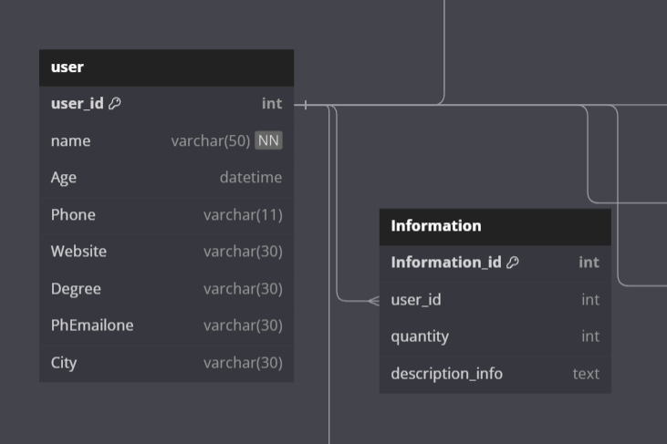

# Join in database 

## Inner và Outer join 

### Điểm khác nhau 
 
 Inner là sẽ chỉ lấy điểm chung sự liên quan giữa hai table được join với nhau  .  
   
 nó sẽ chỉ return ra record mà match cả hai table 

 Outer thì nó sẽ lấy cả điểm chung và điểm riêng giữa hai table được join với nhau  
 


Cách thức hoạt động sẽ như sau  : 
Inner join , sẽ so sánh từng record với 1 list record bên table kia . nếu match thì nó sẽ giữ lại , ko thì sẽ loại bỏ  
VD :  


Như trên ta có hai bảng là *user* và *Information* , liên kết khóa ngoại với nhau qua trường *user_id*
Bây giờ nó sẽ hoạt động như sau  : 
Đầu tiên nó sẽ gộp thành 1 table =>  như ở đây sẽ thành 1 bảng có *8+4=12* column 
Lấy từng record bên *user* so sáng 1 list record bên *information* nếu mà hai cái user_id giống nhau thì nó sẽ giữ lại làm kết quả,

Ban đầu ta có bảng *user*  


Và ta có bảng *in4*  


Bước đầu gộp bảng   


Sau đó lấy từng record bên phải đi so sánh (điều kiện join) , ví dụ ở đây là user_id 


Những cái nào match thì sẽ được giữ lại : 


Tiếp tục với record tiếp theo :  


Như vậy kết quả sẽ là một list dòng màu xanh như hình ảnh 

 Syntax  inner join  :   
 ```js
 SELECT column_name(s)
FROM table1
INNER JOIN table2
ON table1.column_name = table2.column_name;
 ```

Outer join cũng thực hiện bước đầu như inner join
nhưng cái mà outer quan tâm hơn là các rocord mà không match với record nào bên table kia , nó sẽ giữ lại và các cột nào ko match sẽ fill giá trị *null*

Tùy vào loại Outer mà chúng ta sẽ fill *null* 
### lEFT JOIN 


*left join* sẽ return tất cả các column của table bên trái , những record nào ko match lại thì sẽ fill *null* 

VD : Như hình ảnh của inner join bên trên , ta có 1 record ko match với bất cứ record nào bên *in4*


Thì lúc đó output của left join là  


Ta thấy bên table left sẽ đủ cả 3 record ban đầu , các trường mà ko match sẽ fill null 

Mục đích sử dụng :  Ta hay dùng cho phương pháp loại trừ , ví dụ như trên mình sẽ ra yêu cầu là tìm các user không có thông tin trong bảng *in4* thì mình chỉ cần select bảng nào có user , có in4 = *null*

```js
 SELECT column_name(s)
FROM table1
LEFT JOIN table2
ON table1.column_name = table2.column_name;
```

### RIGHT JOIN 
tương tự như left join , lần này lấy phần chung giữa 2 table, còn lại giữ nguyên các table ko match của bên phải và fill *null* vào các column của table bên trái 

 

Tiếp tục ví dụ trên  : 
Bây giờ bảng *in4* sẽ có thêm 1 record ko match với với table *user*  


Kết quả của right join :  


 ```js
 SELECT column_name(s)
FROM table1
RIGHT JOIN table2
ON table1.column_name = table2.column_name;
```

### FULL OUTER JOIN 
nó là sự kết hợp của cả left và right join 


 ```js
 SELECT column_name(s)
FROM table1
FULL OUTER JOIN  table2
ON tab
```