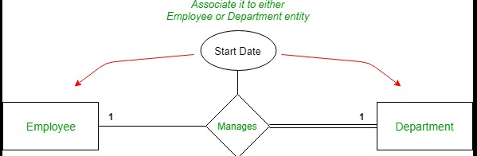
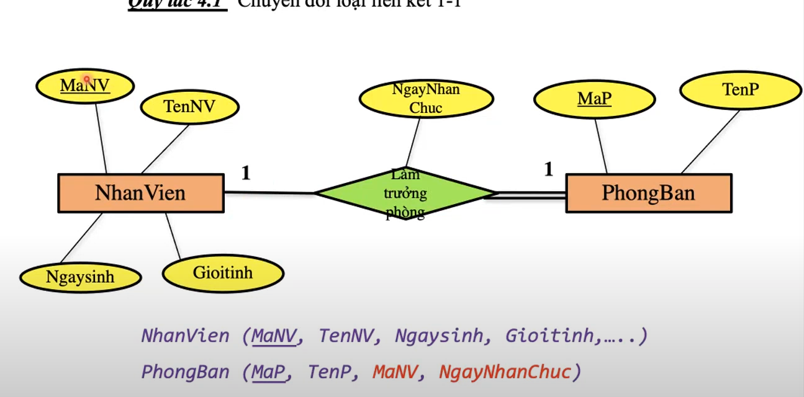
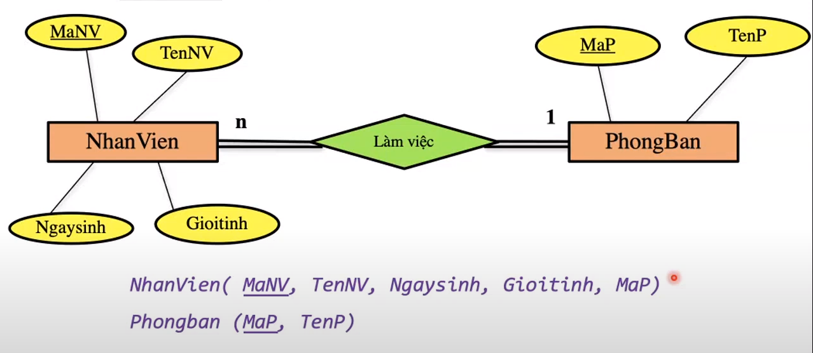
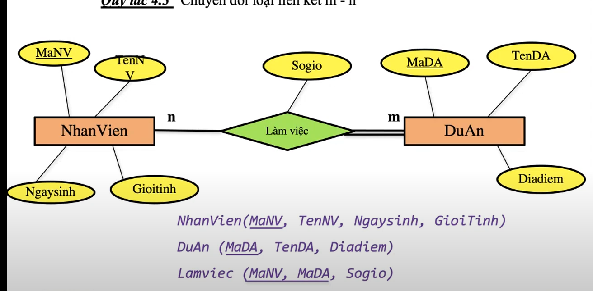
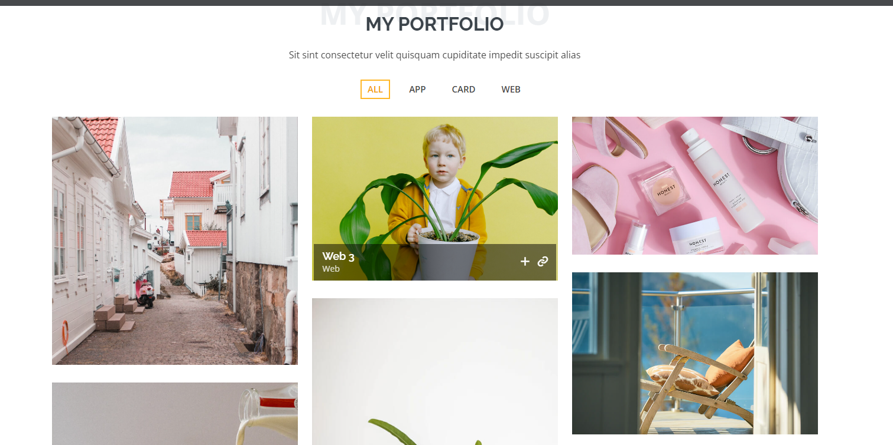
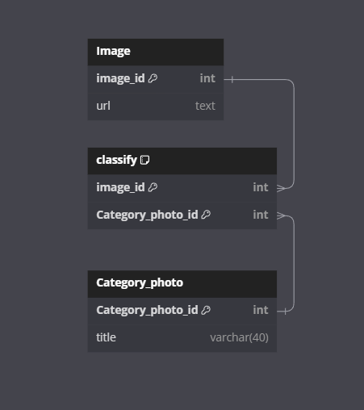
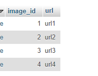
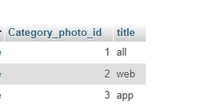
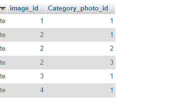
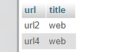

# Relationship in database 

> Đầu tiên sẽ nhắc lại một chút về kiến thức E-R 

## Thuộc tính

### Thuộc tính đơn và đa trị 
  Thuộc tính đơn là các thuộc tính lưu trữ giá trị mà không thể tách nhỏ hơn được nữa  
  Thuộc tính đa trị là các thuộc tính 1 thực thể ở thuộc tính đó có thể nhận nhiều giá trị , ví dụ như *skill* , *bằng cấp*
### Thuộc tính của thực thể và mối liên kết 
  Thuộc tính của thực thể là thuộc tính biểu thị tính đặc trưng của thực thể đó , ví dụ như nhân viên thì có *mã nhân viên *  
  Thuộc tính của mối liên kết là thuộc tính thể hiện tính chất , lưu trữ các giá trị nhằm làm sáng tỏ mối liên kết đó ,
ví dụ như :
      

*start date* chính là thuộc tính của mối liên kết đó vì chỉ khi *employee* làm *manager* thì mới có *start date* , ngược lại nếu ko có thì ko tham gia  

### RÀNG BUỘC THAM GIA 
Ràng buộc bộ phận   : 1 hoặc nhiều thực thể thuộc lớp thực thể  ( ko phải tất cả ) tham gia vào mối liên kết  
Ràng buộc toàn phần : 100 % thực thể thuộc lớp thực thể đó sẽ tham gia vào mối liên kết  
# Các loại kiểu liên kết 

## Loại liên kết 1-1 ( one to one )



Quy tắc chuyển đổi từ ER-> quan hệ :
> Đặt khóa của bên tham gia bộ phận sang bên tham gia toàn phần làm khóa ngoại

**Trả lời câu hỏi tại sao lại đặt như vậy**
Tất cả phòng ban đều có người làm trưởng phòng , cần có maNv để truy xuất xem ai là trưởng phòng bên nhân viên , và điều thứ 2 là , không phải nhân viên nào cũng làm trưởng phòng  nếu đặt ngược lại thì có record sẽ bị null ?  
(tóm lại , toàn phần luôn tham chiếu được sang nhân viên nếu đặt khóa như vậy )

###  Cách query dữ liệu 
```js
SELECT * from nhanvien join phongban on nhanvien.MaNV = phongban.MaNV

//inner join 
```

## Loại liên kết 1-n ( one to many ) 



Giải thích :  nhiều nhân viên ( toàn bộ thực thể nhân viên) làm việc trong 1 phòng ban , một phòng ban có nhiều nhân viên làm việc

Quy tắc chuyển đổi :  
Đưa khóa của bên 1 sang làm thuộc tính của bên nhiều , tại sao lại thế , giống như cái trên , những nhân viên cần tham chiếu đến 1 phòng , thì trong record của nhân viên sẽ có thâm 1 cột là mã phòng 

###  Cách query dữ liệu 
```js
SELECT * from nhanvien join phongban on nhanvien.MaP = phongban.MaP

//inner join 
```

##  Loại liên kết n-m (many to many )



Giải thích :
Một nhân viên có thể làm nhiều dự án , một dự án cũng có nhiều nhân viên làm việc 

Quy tắc chuyển đổi :  
Tạo tham bảng mới để chứa hai cái khóa của hai bảng thành viên , chuyển thành quan hệ 1-n giữa 3 bảng 

Lấy case thực tế : 



Một cái ảnh có thể thuộc nhiều category , và một category có nhiều ảnh 



sinh ra 1 bảng mới là classify :  
1 image thì có nhiều classify , 1 category cũng có nhiều classify 

###  Cách query dữ liệu 


```js
lấy dữ liệu của bảng image 

SELECT * FROM `image`;

```
output :



```js
lấy dữ liệu của bảng category 

SELECT * FROM `category`;

```
output :



```js
lấy dữ liệu của bảng classify 

SELECT * FROM `classify`;

```
output :



> ảnh này có nghĩa là ảnh 1 thuộc all, , ảnh 2 thuộc all và web , ....


```js
lấy tất cả cái ảnh mà thuộc web 

SELECT url, title from (image join classify on image.image_id = classify.image_id)
join category_photo on classify.Category_photo_id = category_photo.Category_photo_id
 WHERE category_photo.Category_photo_id = 2;


```
output :



##  Loại liên cha con 

Loại này liên quan đến thừa kế 
